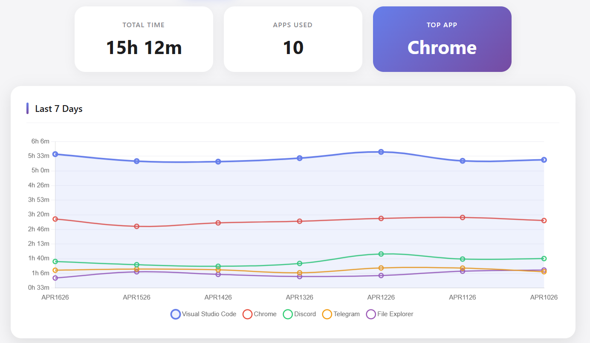
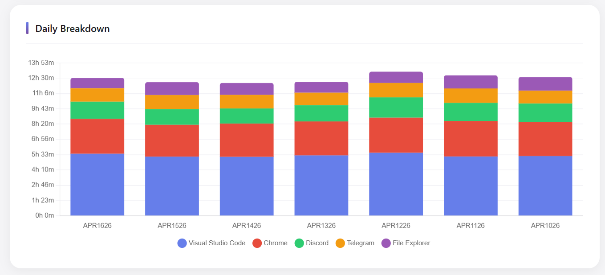

# Blue Dove - PC Activity Tracker

Tracks which apps you use and for how long.

**Windows only**

## Preview





## Setup

```bash
python -m venv venv
venv\Scripts\activate
pip install -r requirements.txt
```

## Run

```bash
# Terminal 1: Start tracking
python src/main.py

# Terminal 2: Start dashboard
python server.py
```

Open browser: http://localhost:8000

## Sample Data

```bash
python create_sample_db.py
```

## Features

- **Activity Tracking**: Monitors active windows and tracks usage time
- **SQLite Database**: Stores usage data with auto-cleanup of old records
- **Dashboard UI**: Modern web interface with multiple chart types
- **Auto-refresh**: Dashboard updates automatically every 5 seconds

## Dashboard Views

| View | Description |
|------|-------------|
| **Last 7 Days** | Line chart + stacked bar chart showing trends over time |
| **Pie** | Pie chart with center showing total hours |
| **Bar** | Horizontal bar graph for easy comparison |
| **Doughnut** | Doughnut chart with center showing total hours |
| **Table** | Detailed breakdown with time, percentage, and hours |

## Interactive Features

- Switch between Usage Data and Sample Data databases
- Select any date to view that day's stats
- Hover over charts to see time + percentage
- Smooth swipe animations when switching views
- Responsive design for mobile and desktop

## Files

| File | Purpose |
|------|---------|
| `src/main.py` | Activity tracker - monitors active windows |
| `server.py` | Dashboard server with REST API |
| `src/data_manager.py` | SQLite database operations |
| `src/utils.py` | Helper functions |
| `ui/index.html` | Dashboard HTML structure |
| `ui/dashboard.css` | Dashboard styling |
| `ui/dashboard.js` | Dashboard JavaScript logic |
| `config/settings.py` | App configuration |
| `create_sample_db.py` | Generate sample data for demo |
| `data/usage.db` | Main usage database |
| `data/sample_usage.db` | Sample/demo database |

## Settings

Edit `config/settings.py`:

- `WINDOW_CHECK_INTERVAL` - Seconds between window checks (default: 1)
- `KEEP_DAYS` - Days of data to keep before cleanup (default: 10)

## API Endpoints

| Endpoint | Description |
|----------|-------------|
| `/` | Dashboard UI |
| `/api/info` | Database info |
| `/api/dates` | List of available dates |
| `/api/use/<db>` | Switch database (main/sample) |
| `/api/data/<date>` | Usage data for specific date |

## Requirements

- Python 3.8+
- Windows (uses win32gui for window tracking)
- pywin32

## Changelog

- v2.0 - Complete UI redesign with modern dashboard
  - Multiple chart types (Pie, Bar, Doughnut, Line)
  - Last 7 Days trends view
  - Interactive hover tooltips
  - Smooth page transitions
  - Separate CSS/JS files
- v1.0 - Initial tracker with basic MySQL storage
